# Figures

```
pip install 'nook[plot]'
python demos/make_figures.py                    # RIPL-3 figures only
python demos/make_figures.py ~/ensdf            # everything
```

Every function returns matplotlib's `(figure, axes)`, so nothing is a dead end
— keep adjusting before you save. PDF output is vector, for LaTeX `\includegraphics`.
Full signatures live in the {mod}`nook.plotting` API reference.

The [RIPL-3 figures](#gdr-lorentzians) draw from the committed mirror, so they
regenerate with no external data; the ENSDF figures need a local distribution
and are skipped with a note when it is absent.

## Design

Two decisions drive the look.

**Type.** Latin Modern with Computer Modern mathtext: the same faces as the
LaTeX body text these figures sit beside. Matplotlib's DejaVu default is what
gives away a figure made in a hurry.

**Colour encodes parity.** Positive and negative parity get their own hue, so
the parity structure of a band is visible before a single label is read.
Unassigned parity stays grey, so missing data looks missing.

Everything else is restraint: hairline rules, no gridlines, no boxes, and
labels that move out of each other's way rather than overprinting.

Where a label cannot avoid a stroke — a feeding arrow crossing its own
annotation, a dodge leader reaching its number — it carries a soft halo in the
paper colour. That is invisible against blank paper and only appears where it
is doing work.

Placement is rule-based first (dodge this column, stagger that one along its
arrow) and then *measured*: `separate_labels()` renders the figure, finds
overlapping pairs in pixels, and nudges them vertically until none remain.
Rules alone got 225 of 233 real decay schemes clean; the measured pass takes it
to 428 of 428 across fifty mass chains, which is what the test asserts. The
lesson was that tuning offsets against one figure looks finished long before it
is.

## Level schemes

```python
from nook.plotting import plot_level_scheme

scheme = el.level_scheme("180Ta", source="file")
fig, ax = plot_level_scheme(scheme, limit=12)
```

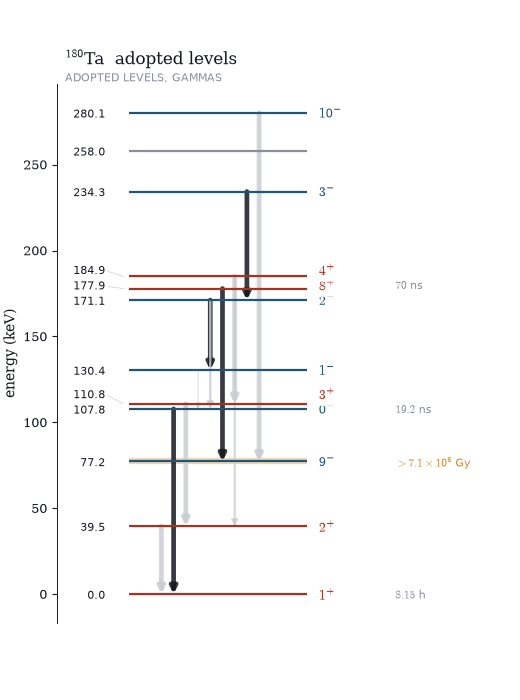

Levels are horizontal rules on an energy axis; transitions run *downward* from
the level they depopulate, with width tracking intensity on a square-root
scale — linear makes everything but the strongest invisible, log flatters the
weakest. Arrows fan across the level so a cascade reads as several transitions
rather than one thick line.

`limit` caps the level count from the bottom up. A 240-level scheme drawn in
full is a black rectangle.

## Band schemes

```python
fig, ax = plot_band_scheme(scheme, max_bands=4, max_energy=3000)
```

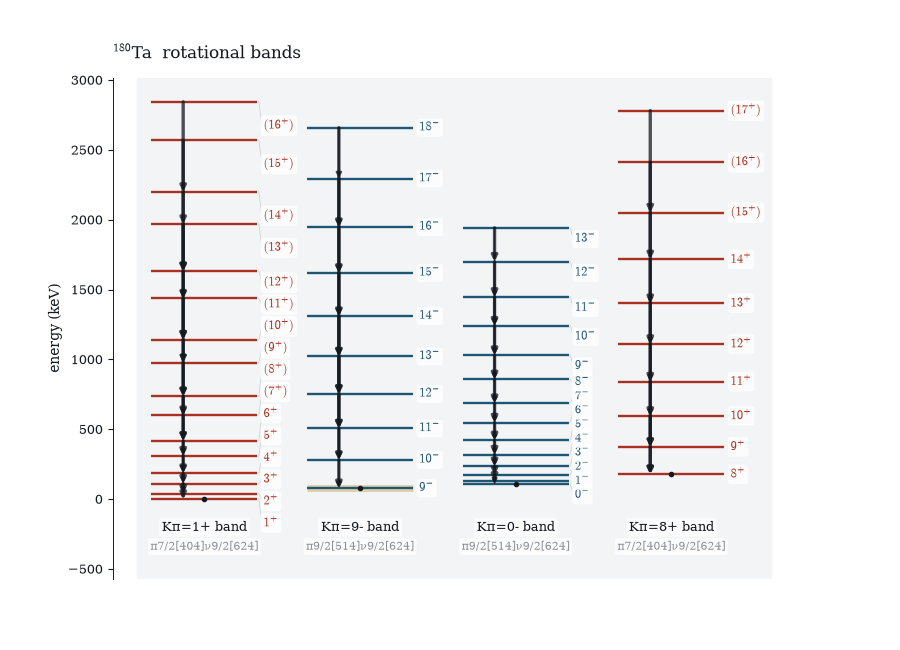

One column per rotational band, ordered by bandhead, each tinted and captioned
with its decoded `BAND()` text and Nilsson configuration. The K-isomer then
reads as its own structure instead of being interleaved into a single crowded
ladder — and the Gallagher–Moszkowski pairing is visible directly, since the
1⁺/8⁺ doublet shares a configuration with the same colour.

## Decay schemes

```python
decay = next(d for d in el.decay_schemes("180Hf") if "180LU" in d.dsid)
fig, ax = plot_decay_scheme(decay)
```


Parent above, daughter ladder below, feedings leaving the parent bar at their
own point and running diagonally to their level. Because departure point and
arrival energy increase together, the fan never crosses itself — which
right-angled routing could not manage.
The levels need only enough width to carry a label, so the arrows get the rest
of the horizontal budget — a third of the figure against a fifth for the levels.

The two quantities get separate channels: arrow **width** is intensity, arrow
**darkness** is log *ft*, dark meaning fast. Printing every log *ft* beside its
arrow works for four or five branches and turns to noise past that, so only the
extremes are labelled in place — fastest, slowest, and strongest branch — with
the rest carried by a slim log *ft* scale. `annotate=` overrides the count.

Intensities are drawn per 100 parent decays whenever the dataset has an `N`
record, and the subtitle says which scale you got, because relative intensities
are meaningless outside their own dataset.

## Chart of nuclides

```python
from nook.survey import survey
from nook.plotting import plot_chart

states = survey(path="~/ensdf")          # one pass over every mass chain
fig, ax = plot_chart(states, colour_by="decay")
```

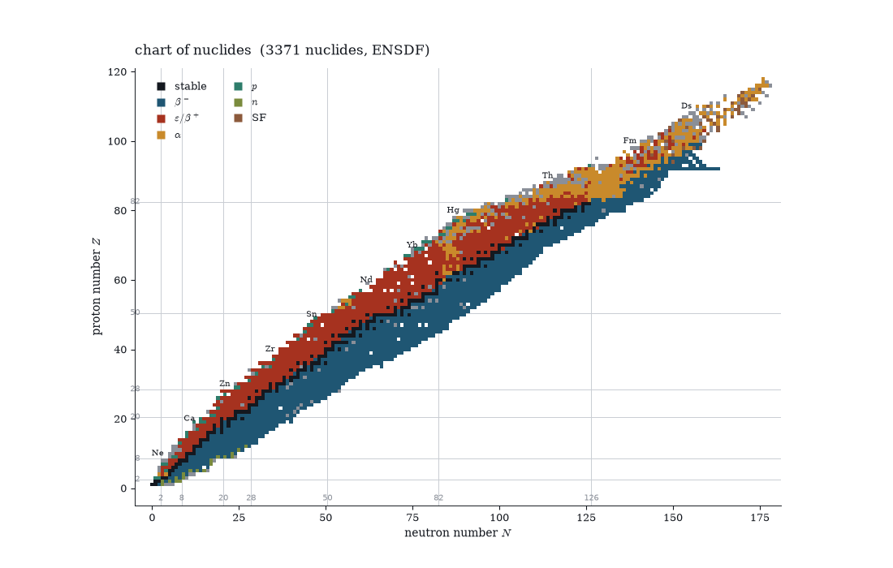

`survey()` walks every local mass chain and returns a `NuclideSummary` per
nuclide — 3168 of them from a full distribution — cached to JSON beside the
data. Magic numbers are ruled because they are the coastline everyone
navigates by.

`colour_by="decay"` uses the field's categorical convention, re-hued to match
the rest of the package. The dominant branch is the *largest* one, read from
the `%` branchings, not a fixed precedence: ²³⁸U has both α and SF open and α
is six orders of magnitude stronger.

Any numeric attribute gets a continuous ramp instead:

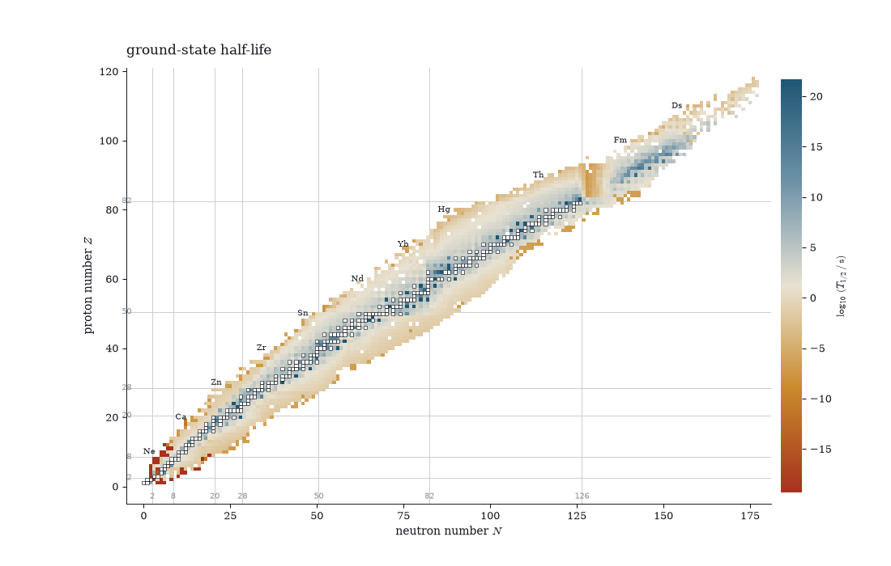

Stable nuclides keep a dark outline under any ramp, so the valley stays legible.

Where a second backend carries the same quantity, `plot_chart_panels` stacks
one panel per source on a **single shared scale** — separate scales would
compare nothing. RIPL's levels headers carry S(n) derived from its own mass
table, so agreement with the ENSDF Q-record values is a cross-backend
consistency check:

```python
from nook.plotting import plot_chart_panels

ripl_sn = ...   # states built from Ripl3Source().sn_table(); see the demo
plot_chart_panels([("ensdf", states), ("ripl3 levels", ripl_sn)],
                  colour_by="s_n")
```

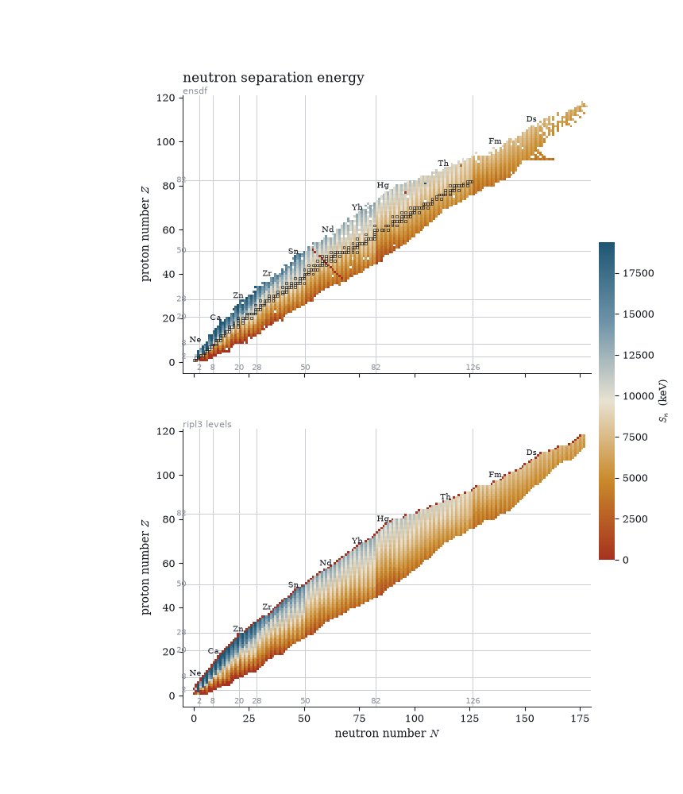

The S(n) chart is also a check on the parser: the shell closures at
N = 20, 28, 50, 82 and 126 fall straight out of the Q records as sharp drops,
and the odd–even staggering stripes both panels identically. The few red
streaks that appear only in the ENSDF panel are the transcription errors the
repaired chart below deals with.

`mark=` rings a set of nuclides. Combined with `repair()` this shows both what
was corrected and what still is not trusted:

```python
fixed, changes = repair(states)
suspect = {state.nuclide for state, _ in inconsistencies(fixed)}
plot_chart(fixed, colour_by="s_n", log=False, mark=suspect,
           mark_label="still inconsistent")
```

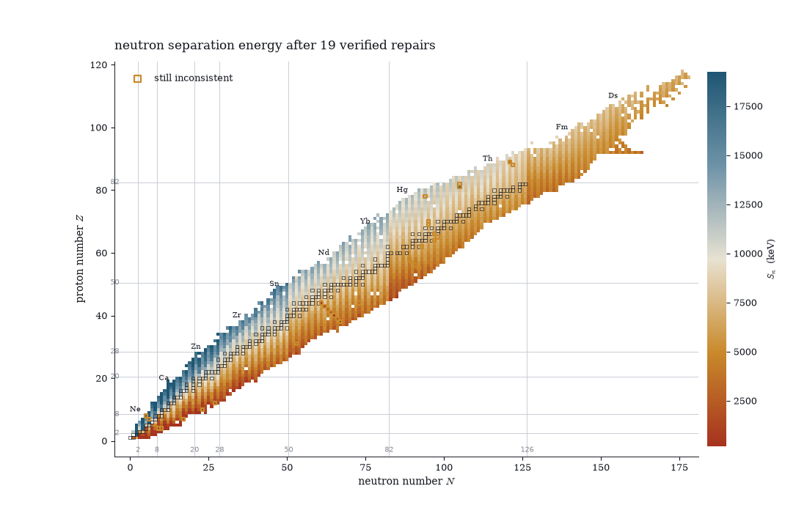

Twenty-two verified repairs, and the nine nuclides still flagged are ringed —
written up individually in [suspicious entries](suspicious-entries.md).

## GDR Lorentzians

```python
from nook.plotting import plot_gdr

src = el.Ripl3Source()
fig, ax = plot_gdr(src.gdr("181Ta"))
```

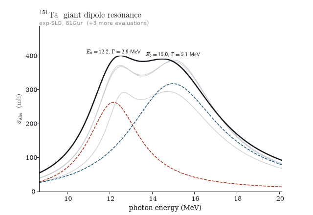

The exp-SLO parameters *are* a Lorentzian parameterisation, so the figure
draws them through the standard shape — components dashed in the two package
hues, their sum in ink, other references as thin grey sums so the evaluation
spread is visible without competing. ¹⁸¹Ta is deformed, and the split between
the two components is the deformation.

MLO and theoretical entries are deliberately not drawn as curves: MLO widths
are temperature-dependent, and the theory table carries no peak cross-section,
so rendering either through the SLO shape would present a curve the record
does not contain.

## Gamma strength functions

```python
fig, ax = plot_gsf(src.gsf("56Fe"), sn_kev=src.levels("56Fe").sn_kev)
```

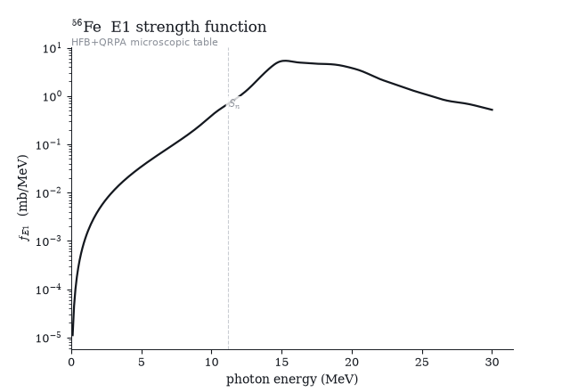

The microscopic (HFB+QRPA) E1 table on a log axis, with a hairline at the
neutron separation energy — the point below which capture calculations
actually sample the curve, four orders of magnitude under the GDR peak that
dominates the plot.

## Level densities

```python
fig, (ax_rho, ax_cum) = plot_level_density(
    src.hfb_density("57Fe"), scheme=src.fetch("57Fe"),
    ct=src.levels_param()[(26, 57)],
)
```

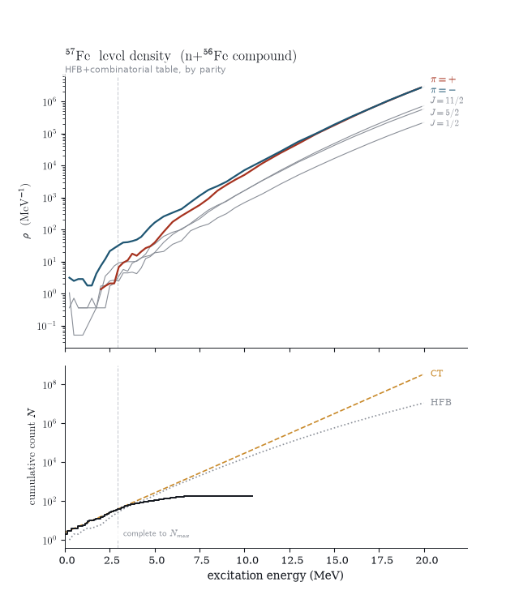

One story on a shared energy axis, for ⁵⁷Fe — the n+⁵⁶Fe compound system,
which is how RIPL keys its density tables. The top panel is the HFB density
by parity: the one figure in the gallery where the parity palette is not a
labelling convention but the physics itself, plus a few spin-resolved curves
in grey. The bottom panel sets the discrete-level staircase against the
constant-temperature fit and the HFB cumulative count.

The hairline spanning both panels is RIPL's own completeness cutoff `Nmax`.
Where the staircase falls away from the model curves above the line, levels
are missing from the evaluation, not from nature — that divergence is the
figure's point, and the reason the discrete and statistical descriptions have
to be spliced somewhere. The resonance spacing `D0` these densities are
normalised against lives in the [resonance chart](#resonance-systematics).

## Matter densities

```python
fig, ax = plot_matter_density(src.matter_density("208Pb"))
```

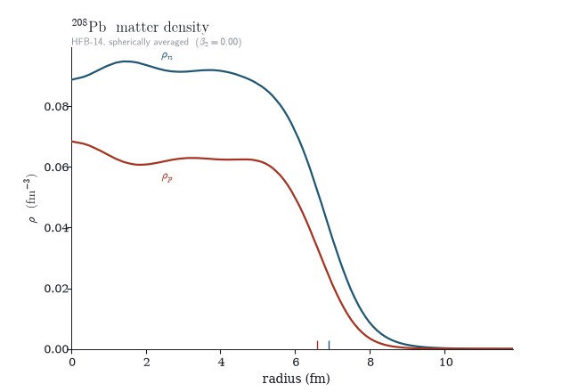

Neutron and proton radial profiles in the colours every reader guesses
unprompted — neutrons blue, protons red — labelled inline instead of with a
legend. The baseline ticks mark each species' half-central-density radius, so
the neutron skin is a visible offset between two ticks rather than a number
in a caption.

## Fission barriers

```python
fig, ax = plot_fission_barriers(
    src.fission_barriers("238U"),
    overlay=src.fission_barriers("238U", model="hfb"),
)
```

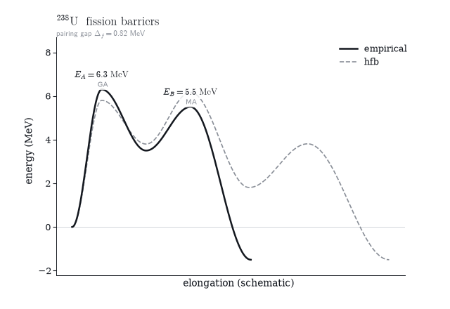

The double-humped potential the barrier parameters describe. Heights and
curvatures are the evaluated numbers — saddle widths scale with 1/ħω — and
everything else is presentation, which is why the deformation axis says
*schematic* on it. The overlay pins the HFB saddles onto the empirical
positions so the comparison reads as heights, not shapes; symmetry codes
(`GA` axially asymmetric, `MA` mass asymmetric) sit under each annotation.

## Mass models against experiment

```python
table = src.mass_table()
fig, axes = plot_mass_residuals(table)       # frdm95 | hfb14 panels
fig, axes = plot_deformation_chart(table)
```

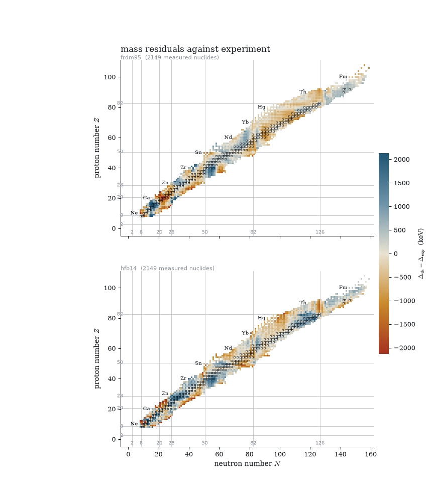

Theory minus experiment for both mass models against the same Audi
experiment, one panel each, on one colour scale symmetric about zero so the
ramp reads as signed error and the panels are directly comparable. The
residual patterns land exactly on the magic-number gridlines the chart always
draws — and the two models fail differently there, which is the point of
showing them together: FRDM's structure concentrates at the closures its
macroscopic part misses, HFB-14's error field is organised differently around
the same lines. Only measured masses count as experiment; `recommended_only`
entries are systematics and are excluded.

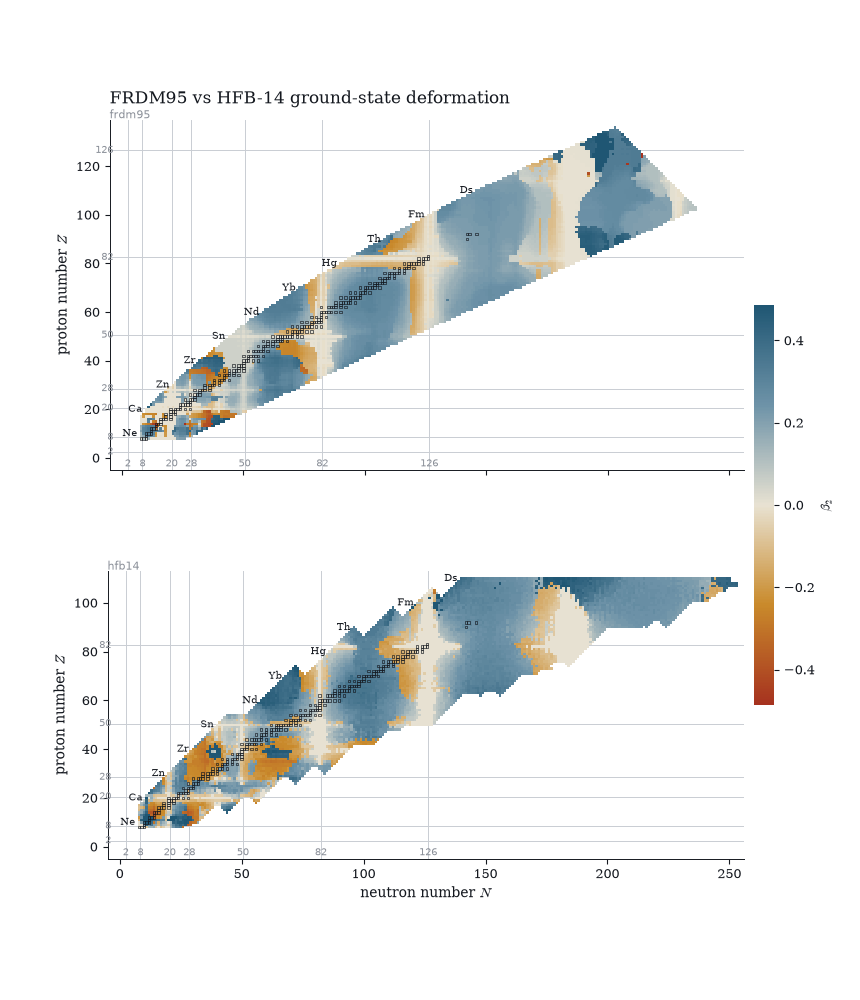

The same table coloured by ground-state β₂, FRDM95 above HFB-14: spherical
stripes along the magic numbers, the rare-earth and actinide islands of
deformation in blue, oblate pockets in orange. The models mostly agree on
where deformation lives and disagree nuclide-by-nuclide where prolate and
oblate minima are nearly degenerate — around ⁷⁴Nb both go oblate in a sea of
prolate neighbours, the A ≈ 70–80 shape-coexistence region showing up as
single flipped squares.

## Resonance systematics

```python
fig, axes = plot_resonance_charts(src.resonance_table())
```

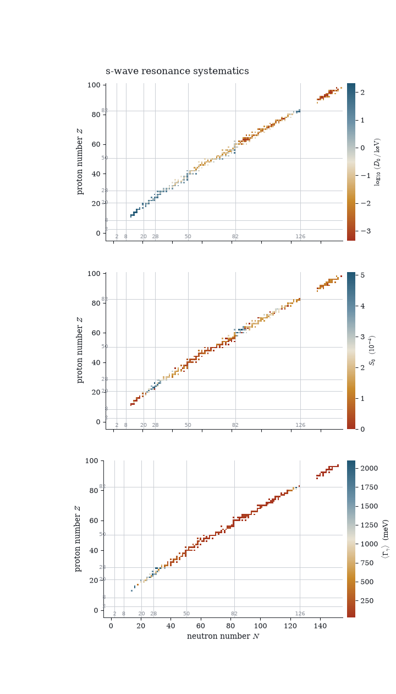

Three panels because the three quantities answer different questions: `D0` is
a level-density measurement (log colour — it spans five orders of magnitude
from shell closure to mid-shell), `S0` a doorway-state average, and the
radiative width the temperature of the gamma cascade. The panels share the
neutron axis, so the N = 28, 50, 82, 126 spikes in `D0` line up under each
other.

## Comparing sources

```python
comparison = el.compare.levels("24Mg", sources=("file", "ripl3"), below=10000)
fig, ax = plot_level_comparison(comparison)
```


The comparison `nook.compare` exists to make, drawn: matched levels joined
across the gutter, levels only one source has ticked outward so a dropped
level looks dropped, and both completeness cutoffs as dashed hairlines — our
heuristic on the ENSDF side against RIPL's own `Nmax`. Energies are labelled
once, on the left: matched energies agree to a keV or better, and repeating
them doubles the label load for no information. Side b labels its Jπ — the
quantity that genuinely can differ.

One rule carries over from the parser: a spin the RIPL evaluators *assumed*
(their `g`/`c`/`n` flags) is drawn grey whatever its parity, so RIPL's
statistical guesses never wear the colours of an evaluated assignment.

## What is deliberately not drawn

Two RIPL segments have no figure. The optical-model archive is a table of
potential *coefficients*, and nook does not evaluate V(r) — that is a
reaction code's job, and a coefficient table drawn as a curve would claim an
evaluation that never happened. Per-level coupled-channel deformations are
niche input whose story the β₂ chart already tells.
