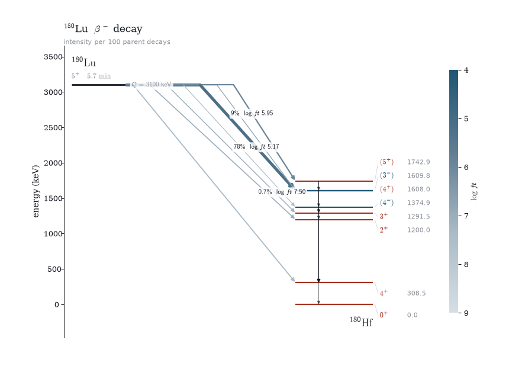

# nook

A nook for nuclear structure data: level schemes from ENSDF and RIPL-3, with
the awkward parts — significant-digit uncertainties, spin-parity alternatives,
widths masquerading as half-lives, Fortran fixed-format files — parsed into
real objects instead of strings.

No required dependencies. `pandas` is optional, for `.to_dataframe()`;
`matplotlib` is optional, for the [figures](figures.md).

```python
import nook

scheme = nook.level_scheme("24Mg")          # adopted levels, via the IAEA API
for lv in scheme.below(10_000):
    print(lv.energy_kev, lv.spin_parity, lv.half_life.seconds.value)
```



## Three backends, one data model

| | `livechart` (default) | `file` | `ripl3` |
|---|---|---|---|
| Source | IAEA Livechart API | NNDC archival flat files | RIPL-3 mirror on disk |
| Coverage | **adopted levels only** | every evaluated dataset | levels + reaction inputs |
| Needs network | yes (responses cached) | no | no |
| Setup | none | download mass chains, set `$ENSDF_PATH` | committed mirror, or `$RIPL_PATH` |

All three return the same {class}`~nook.LevelScheme`, so downstream code
doesn't branch. For a specific evaluation rather than the adopted set:

```python
scheme = nook.level_scheme("24Mg", source="file", dataset="(P,T)")
```

Flat files come from <https://www.nndc.bnl.gov/ensdfarchivals/> — one per mass
number, `ensdf.024`. Extract them somewhere and export `ENSDF_PATH`.

RIPL-3 goes beyond levels: masses (experimental and theory), average resonance
parameters, giant dipole resonances and gamma strength, optical-model
potentials, level densities and fission barriers. Where sources overlap,
{mod}`nook.compare` matches them:

```python
result = nook.compare.levels("24Mg", sources=("file", "ripl3"))
result.rms_delta_kev            # 1.5 keV over 72 matched levels
nook.compare.masses("180Ta")    # AME vs RIPL vs FRDM95 vs HFB-14
```

## Install

```
pip install 'nook[plot]'
```

Extras: `plot` (matplotlib figures), `pandas` (`.to_dataframe()`),
`uncertainties`; `dev` pulls in all of them plus pytest. Or, working from a
checkout with [uv](https://docs.astral.sh/uv/):

```
uv sync --extra dev        # creates .venv with the package and dev extras
uv run pytest              # ~5 s against committed fixtures
uv run nook 24Mg           # the CLI
```

```{toctree}
:caption: User guide
:maxdepth: 1

usage
figures
ripl3
```

```{toctree}
:caption: Reference
:maxdepth: 1

api/index
ensdf-format
uncertainties
```

```{toctree}
:caption: Development
:maxdepth: 1

testing
limitations
suspicious-entries
```
