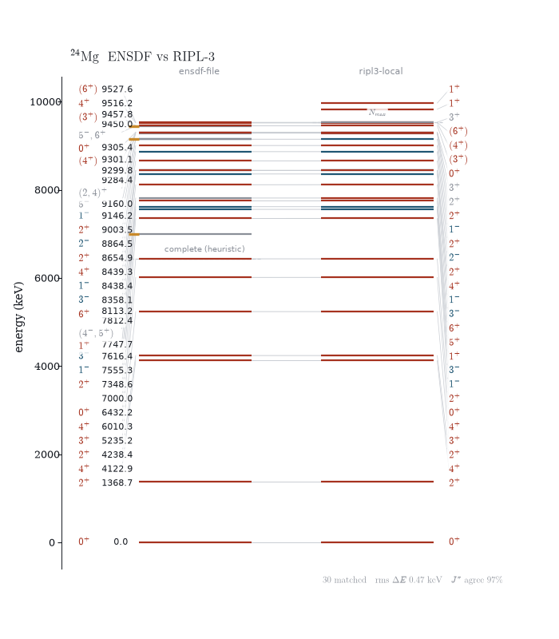

# RIPL-3

RIPL-3 is the IAEA's Reference Input Parameter Library — the input side of
nuclear reaction modelling: discrete levels, masses, resonance spacings, level
densities, gamma strength, optical potentials, fission barriers. Cite it as
R. Capote et al., *Nucl. Data Sheets* **110** (2009) 3107; the discrete-levels
segment used here is the 2021 cut.

Unlike the other two backends, RIPL-3 is **static** — no API, no releases to
track — so the whole library is mirrored into the repository and parsed from
disk.

## The mirror

```
python tools/fetch_ripl3.py --record     # first population: download + hash
python tools/fetch_ripl3.py --verify     # offline integrity check
python tools/fetch_ripl3.py --refresh levels   # re-pull one segment
```

The mirror lives at `data/ripl3/<segment>/` (~1.2 GB extracted, excluded from
wheels and sdists); `data/ripl3/MANIFEST.json` records a sha256 for every
extracted file. Downloads resume; archives are transient under
`data/ripl3/_archives/` (gitignored). A wheel install has no mirror — point
`$RIPL_PATH` at one instead.

One index link is dead upstream: `masses/gs-deformations-exp.dat` 404s (as of
2026-07) and is deliberately absent; theoretical deformations are still in
`mass-frdm95.dat`.

## Units

RIPL files are in MeV; everything here converts to **keV at parse time** so
levels line up with the ENSDF backends. Exceptions keep their natural unit and
say so in the name (`gamma_width_mev_milli`, `bn_mev`, barrier heights in MeV).
`nook.sources.ripl3.RIPL3_UNITS` is the full mapping, and
`RIPL3_EVALUATIONS` the attribution. One normalisation to know about: the EGSM
level-density file ships D0 in keV while bfm/ctm/hfm ship eV — all four are
served as `spacing_kev`.

## Levels

RIPL levels derive from ENSDF, repackaged per element with two extras worth
having: the evaluator's completeness cutoff `Nmax` (how far the scheme can be
trusted to be complete) and a numeric spin for every level, flagged when it
was estimated rather than measured.

```python
import nook

scheme = nook.level_scheme("24Mg", source="ripl3")       # a normal LevelScheme
block = nook.Ripl3Source().levels("24Mg")                # raw counts + cutoffs
nook.Ripl3Source().fetch("24Mg", up_to_nmax=True)        # truncate at Nmax
```

`up_to_nmax` is RIPL's own judgement; `scheme.complete_up_to()` is our
heuristic. Comparing the two is the point of `nook.compare`.

## The other segments

All through `Ripl3Source` (each returns frozen dataclasses; `--json` on the
CLI):

```python
src = nook.Ripl3Source()
src.masses("24Mg")                  # Audi + FRDM95 + HFB-14 mass excesses, β2, abundance
src.mass_table()                    # the same for every nuclide, keyed (z, a)
src.ground_state("24Mg")            # projected onto the shared GroundState model
src.matter_density("208Pb")         # HFB-14 radial matter density
src.resonances("27Al", wave=0)      # D0, S0, Γγ for the *target* nuclide
src.resonance_table(wave=0)         # every target's parameters, keyed (z, a)
src.gdr("181Ta")                    # GDR Lorentzians, experimental fits then theory
src.gsf("56Fe")                     # HFB+QRPA E1 strength table
src.fission_barriers("238U")        # empirical (or model="hfb")
src.optical_potentials(nuclide="56Fe", projectile="n", energy_mev=14.0)
src.deformations("12C")             # coupled-channel deformation parameters
src.level_density_params("57Fe")    # analytic models: egsm, bfm, ctm, hfm
src.hfb_density("57Fe")             # ρ(E, J, π) table with .rho() lookup
src.levels_param()                  # constant-temperature fit table, every nuclide
src.sn_table()                      # S(n) from every levels header, keyed (z, a)
```

Most of these have a figure in the [gallery](figures.md#gdr-lorentzians):
GDR fits, strength functions, level densities against the discrete staircase,
matter densities, fission barriers, mass-model residual and deformation
charts, and resonance systematics — all drawn from the mirror, no external
data needed.

Two conventions that look like bugs but are not:

- **Density and resonance-derived quantities are keyed by the compound
  nucleus.** The level-density row for the n+56Fe system is `57Fe`, not
  `56Fe`. Resonances are the exception — they're filed under the *target*.
- **Optical potentials are records, not potentials.** The archive's
  energy-dependent coefficient tables are parsed in full, but nothing here
  evaluates V(r); that's a reaction code's job.

## Comparison

Where sources overlap, `nook.compare` matches them: greedy one-to-one
nearest-neighbour for levels (within `max(tolerance, 3σ)`), keyed evaluations
for masses.

```python
result = nook.compare.levels("24Mg", sources=("file", "ripl3"))
result.rms_delta_kev, result.jpi_agreement_fraction
result.only_a, result.only_b        # levels one source dropped
result.cutoff_a, result.cutoff_b    # heuristic complete_up_to vs RIPL's Nmax

nook.compare.masses("180Ta")        # ame-livechart / ripl-exp / frdm95 / hfb14
```

Because RIPL levels derive from ENSDF and the two parsing chains share no
code, a low-lying comparison doubles as an end-to-end test — that's
`tests/test_compare.py::test_compare_24mg_ripl_vs_ensdf_adopted_matches_low_lying`.

`plot_level_comparison` draws the same object — matched levels joined across
the gutter, both completeness cutoffs as hairlines
([figure](figures.md#comparing-sources)):



## CLI

```
nook levels 24Mg --source ripl3 --nmax
nook ripl masses 24Mg
nook ripl resonances 27Al --wave 0
nook ripl gdr 181Ta
nook ripl fission 238U --model hfb
nook compare 24Mg --what levels --below 8000
nook compare 180Ta --what masses --no-livechart
```
